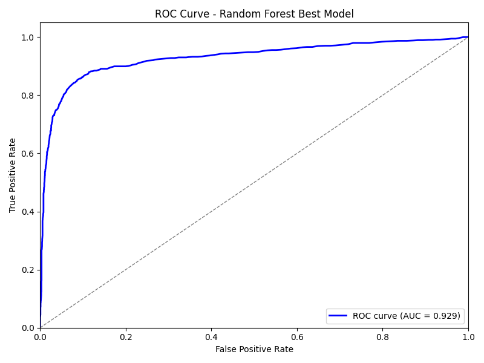

# Report: Classification Analysis

## 1. Цель исследования

Сравнить работу различных классификаторов на заданном датасете, включая:

- RandomForest (с оптимизацией параметров)
- GradientBoosting (контролируемая конфигурация)
- DecisionTree (контролируемая конфигурация)
- LogisticRegression
- DummyClassifier (базовый бейзлайн)

Метрики оценки: **accuracy**, **F1-score**, **ROC-AUC**.  
Дополнительно построены **ROC-кривые** и **confusion matrix** для лучшей модели.

---

## 2. Метрики на тестовой выборке

| Model                        | Accuracy | F1-score | ROC-AUC |
|-------------------------------|---------|----------|---------|
| RandomForest_best            | 0.8922  | 0.7602   | 0.9287  |
| GradientBoosting_controlled  | 0.8700  | 0.7090   | 0.8994  |
| DecisionTree_controlled      | 0.8094  | 0.5653   | 0.8093  |
| LogisticRegression           | 0.8119  | 0.5607   | 0.7977  |
| DummyClassifier              | 0.7375  | 0.0000   | 0.5000  |

**Выводы:**

- RandomForest показывает наилучшие результаты по всем метрикам.  
- GradientBoosting уступает RandomForest, но лучше DecisionTree и LogisticRegression.  
- DummyClassifier демонстрирует случайное угадывание (ROC-AUC = 0.5, F1 = 0).  
- F1-score особенно чувствителен к несбалансированности классов, что видно на DummyClassifier.

---

## 3. ROC-кривые

### 3.1 RandomForest (лучшая модель)



**Вывод:**  

- AUC = 0.929 - модель хорошо различает классы.  
- Кривая находится выше диагонали случайного угадывания.

---

## 4. Confusion Matrix

### 4.1 RandomForest (лучшая модель)


**Вывод:**  

- RandomForest корректно классифицирует большинство объектов.  
- Ошибки в основном приходятся на редкий класс (если есть дисбаланс).

---

## 5. Параметры лучшей модели RandomForest

```json
{
    "max_depth": null,
    "max_features": "sqrt",
    "min_samples_leaf": 1,
    "n_estimators": 400
}
```

Вывод:

Модель использует все уровни глубины (max_depth=null), случайный выбор признаков (sqrt), минимальный размер листа = 1, и 400 деревьев.

Такой набор параметров обеспечивает наилучший баланс между точностью и устойчивостью к переобучению.

---

## 6. Общие выводы

1. **RandomForest** — наилучший выбор для данного датасета, с высокой точностью и ROC-AUC.

2. GradientBoosting и DecisionTree подходят как альтернативы, но уступают по F1 и ROC-AUC.

3. LogisticRegression обеспечивает базовое линейное разделение классов, лучше бейзлайна, но хуже ансамблевых моделей.

4. DummyClassifier служит для оценки уровня случайного угадывания.
